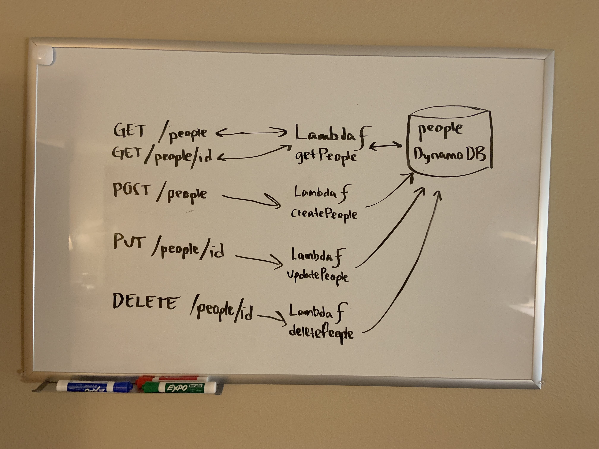

# dynamo

Create a single resource REST API using a domain model of your choosing, constructed using AWS Cloud Services

## Feature Tasks

Routing: API Gateway

- POST
  - /people - Given a JSON body, inserts a record into the database
  - returns an object representing one record, by its id (##)
- GET
  - ✅/people - returns an array of objects representing the records in the database
  - ✅/people/## - returns an object representing one record, by its id (##)
- PUT
  - /people/## - Given a JSON body and an ID (##), updates a record in the database
  - returns an object representing one record, by its id (##)
- DELETE
  - /people/## - Given an id (##) removes the matching record from the database
  - returns an empty object

## Data Flow

- What is the root URL to your API?

 https://w7hp22y7oh.execute-api.us-west-2.amazonaws.com/inprogress/people

- What are the routes?

`/people`

and

`/people/{id}`

- What inputs do they require?

id, name, phone

- What output do they return?

a JSON with id, name, phone
